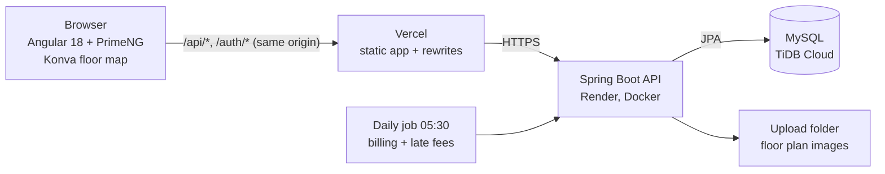

# Mall OS

A multi-tenant platform for running shopping malls. A platform administrator creates malls and assigns each one a manager; the manager uploads the **floor plan**, traces the shop units on it, links every unit to a store (tenant, rent, lease), invites assistants with fine-grained permissions, bills rent every month and watches occupancy. Every mall is isolated from every other, and every change is recorded in an audit trail.

**Spring Boot 4.1 · Java 21 · MySQL · JWT · Angular 18 · PrimeNG · Konva · Docker**

**Live demo:** https://mall-os-self.vercel.app — sign in as `manager` or `assistant`, password `Manager@123`. The free API sleeps when idle: the login page wakes it and waits (up to a few minutes) with a "Waking up the free demo server" note. Demo data only.

| Floor plan coloured by lease (green leased, orange ending within 90 days, crimson ended, red vacant) | Rent invoices and who owes what |
| --- | --- |
|  |  |

| Occupancy, rent per m² and lease expiry | Activity: who did what |
| --- | --- |
|  |  |

| Manager dashboard | Team and permissions |
| --- | --- |
|  |  |

## Architecture



Locally, `docker compose up` runs MySQL, the API and the web app (nginx), every port bound to `127.0.0.1`. The API is split by domain: `mall/` (malls, floors, polygons, stores, members, permissions), `finance/` (invoices), `analytics/`, `audit/` and `auth/`.

**Two levels of identity.** A user has a platform role, `SUPER_ADMIN` or `MALL_USER`. Inside a mall, a `MALL_USER` is a member with a mall role, `MANAGER` or `ASSISTANT`, and an assistant carries a set of permissions (`MANAGE_STORES`, `MANAGE_FLOORPLAN`, `VIEW_REPORTS`, `VIEW_FINANCE`, `MANAGE_FINANCE`, …). Self-registration can only ever create a plain `MALL_USER`; managers are assigned by the super admin, assistants are invited by their manager.

**Every mall call goes through one check.** Security is deny-by-default (only `/auth/**`, the API docs and `/error` are public). Then each service method starts with `PermissionService.assertAccess(userId, mallId, permission)`:
- the user and their membership are read **from the database on every call** (not from the token), so removing a member or a permission takes effect on the next request;
- not a member of that mall → **403**; an assistant without the permission → **403**; a manager → allowed; the super admin → allowed everywhere;
- the record is then loaded with the mall id in the query (`findByIdAndMall_Id`), so a floor or store id from another mall, even inside a URL of the right mall, answers **404**.

**Floor plans.** The manager uploads an image (the real bytes are checked against PNG, JPEG, GIF and WebP signatures, not the extension), then traces polygons on it in a Konva editor. Points are stored as **fractions of the image (0..1)**, and the API rejects anything outside that range, so the same polygon fits the image at any size or zoom. A unit polygon is linked to a store through a `Slot`. The viewer can recolour every unit by its lease state with one click.

**Billing** (`finance/InvoiceService`). Every morning the job bills the current month for every mall, then adds late fees; a manager can also bill any month by hand. A store is billable when it is not vacant and has a rent and a lease start; a lease that starts or ends inside the month pays for its days only (a lease from 11 March pays 21/31). The invoice is due on the 5th and, once overdue and unpaid, carries a one-off 5 % late fee. Each invoice copies the tenant name, store code and store name it was issued with, so renaming a store does not rewrite past invoices. Money is `BigDecimal`, rounded half-up to cents.

**Audit trail** (`audit/AuditService`). Store, floor, member and invoice services call `record(...)` inside their own transaction (`Propagation.REQUIRED`), so the history entry commits or rolls back with the change. A store edit records the before and after of rent, status and lease dates. Managers search it by person, level and kind.

**Analytics** (`analytics/`). Computed on request from the stores: occupancy by floor and category, monthly rent, rent per m² (only units with both a rent and a surface), rent waiting on vacant units, leases ending within 90 days and leases already over with the tenant still in place.

## Key decisions and trade-offs

1. **One shared database with the mall id on every row** (not a schema or database per tenant).
   *Why:* one schema to migrate and back up, and the super admin can see across malls. *Cost:* every query must be scoped by mall; this is enforced in one permission check plus mall-scoped repository methods, and covered by cross-mall tests (another mall's manager, ids smuggled into the wrong mall). *Alternative:* schema per tenant isolates by construction but multiplies migrations and connections.
2. **Permissions re-read from the database on every request**, not carried in the JWT.
   *Why:* deactivating an assistant or removing a permission must work immediately, not when the token expires (24 h). *Cost:* a membership lookup per call.
3. **One invoice per store and month, guaranteed twice.**
   *Why:* the billing job runs daily and managers can run it by hand, so it must be safe to repeat. The service skips stores that already have an invoice for the period, and a unique key on `(store_id, period)` is the backstop if two runs race. *Cost:* no partial credit notes or mid-month rent changes in this version; a store that has invoices cannot be deleted.
4. **Audit written in the caller's transaction.**
   *Why:* a history that can contradict the data is worse than none. *Cost:* every write path must remember to call the audit service; the tests check the main ones. *Alternative:* an event listener after commit would decouple it, but a crash between commit and listener loses the entry.
5. **Polygons as fractions, not pixels.**
   *Why:* the map renders at any size; a pixel-based demo seed once drew every unit off the map. *Cost:* the editor must normalise points before saving.
6. **One origin through Vercel rewrites** (`/api` and `/auth`).
   *Why:* no CORS setup and no API URL baked into the build. *Cost:* request bodies through the proxy are limited to about 4.5 MB (large floor plan images), and the proxy answers 502 while the free API wakes up; the login page retries for about 3.5 minutes.

## Security model

| Who | Can do |
| --- | --- |
| Super admin | create malls, assign managers, read and change any mall |
| Manager | everything inside their own mall: floors, stores, team, finance, audit |
| Assistant | only what the manager granted, in that mall |
| Signed-in user with no membership | nothing in any mall (403) |
| Anonymous | `/auth/**` (login, register as a plain user) and the API docs |

Uploaded images are only served to members of the mall; no response contains a password hash; the API refuses to start with a short JWT key, or with the published development key under the `prod` profile.

**What the audit found and fixed.** The authorization model was already solid, so the audit (running the app and attacking it as an outsider, an assistant and another mall's manager) found the problems around it: `docker compose up` could not start (invalid default `${JWT_SECRET:default}`); every mall call from the web app was a 500 (`/api/malls` vs `/malls`); client mistakes answered 500 instead of 400/415/404; the development JWT key was accepted in production; the backend could manage managers and assistants but the web app had no screen for it (now a **Team** page and an admin Team dialog); decorative controls did nothing (fake notification badge, dead search, hard-coded "+2 this month" trends) and were removed; the demo polygons were in pixels and drawn off the map; a global CSS reset stripped PrimeNG's padding (now in a lower `@layer`); the demo floor image was lost on hosts with an ephemeral disk (now restored from the jar on start).

## Features

- **Floor plans**: upload, trace units, corridors and common areas, link units to stores, colour the map by lease.
- **Stores**: code, category, zone, surface, status (open, closed, under renovation, vacant), owner, lease dates and monthly rent.
- **Rent and invoices**: monthly billing with proration, due date, late fee, Paid and Cancel actions, billed / collected / outstanding / overdue totals and a "who owes what" list sorted by the worst debtor.
- **Occupancy and lease analytics** by floor and category.
- **Audit trail** of every change, with filters; the dashboard shows the latest lines.
- **Team**: managers invite assistants and tick their permissions; the admin assigns managers.

## Run it

Needs Docker with Compose.

```bash
cp .env.example .env     # then set DB_PASSWORD and ADMIN_PASSWORD
docker compose up --build
```

| Service | URL |
| --- | --- |
| Web app | http://localhost |
| API | http://localhost:8080 (Swagger UI at `/swagger-ui.html`) |

On an empty database the first start creates a demo mall with a traced ground-floor plan, 11 stores on two floors (leases that are fine, about to end and already over), three months of rent invoices (some paid, some late), a manager and an assistant.

| Role | Username | Password |
| --- | --- | --- |
| Super admin | `admin` | the `ADMIN_PASSWORD` you set in `.env` |
| Manager of the demo mall | `manager` | `Manager@123` |
| Assistant (manage stores, view reports) | `assistant` | `Manager@123` |

Try this: sign in as `manager`, open **Interactive Map** and press *Show leases*, then **Rent & invoices**. Then sign in as `assistant`: adding a store works, but finance, activity, the floor plan editor and the Team page are refused (occupancy is visible, because it needs the reports permission).

## Tests

```bash
cd backend && mvn test
```

38 tests on an in-memory database, no services needed:

- **Authorization and uploads (21)**: anonymous 401, outsiders 403, cross-mall access, assistants with and without the floor-plan and store permissions, the super admin, registration that ignores a client-supplied role, polygon points outside 0..1 refused, upload validation (non-images refused, image served only to members), duplicate store code 409, malformed bodies 400, no password hash in any response.
- **Team management (5)**: the manager sees the active team without secrets, a removed assistant leaves it, only the manager or an admin may list it, the admin assigns a manager by username or e-mail, client mistakes are 4xx.
- **Finance, audit, analytics (7)**: proration, one invoice per store and month, late fee added once, paid invoices are final, the debtors list, who may see or change finance; what the audit records, its filters, nothing recorded for a failed change, managers only, no cross-mall history; the occupancy figures.
- **JWT key guard (4)** and the application context (1).

Each protection was checked by removing it and watching its test fail. CI runs the tests, builds the web app and validates the compose file.

## Configuration

| Variable | Purpose |
| --- | --- |
| `DB_URL`, `DB_USERNAME`, `DB_PASSWORD` | database (compose fills these in) |
| `JWT_SECRET`, `JWT_EXPIRATION_MS` | token signing key (at least 32 characters; the dev default is refused under `prod`) and lifetime (default 24 h) |
| `ADMIN_USERNAME`, `ADMIN_EMAIL`, `ADMIN_PASSWORD` | the super admin created on an empty database |
| `DEMO_ENABLED`, `DEMO_MANAGER_*` | seed the demo mall (on by default) |
| `SPRING_PROFILES_ACTIVE` | `prod` enables the key guard |
| `mallos.finance.due-day`, `mallos.finance.late-fee-percent`, `mallos.finance.cron` | rent due day (default 5), late fee in percent (default 5), billing job schedule (default 05:30) |

## Deploying (free tiers, works with a private repository)

| Part | Where | How |
| --- | --- | --- |
| Database | TiDB Cloud Serverless | create a database named `mallos` |
| API | Render (Docker) | New, Blueprint, pick this repo: `render.yaml` does the rest; set `DB_URL`, `DB_USERNAME`, `DB_PASSWORD`, `ADMIN_PASSWORD` |
| Web app | Vercel | import the repo, Root Directory `frontend`; `frontend/vercel.json` forwards `/api` and `/auth` to the API |

## Known limits

- The free API sleeps after about 15 minutes idle; the first request after a pause can take from 20 seconds to a few minutes.
- Floor plan images live on the API's disk. On Render that disk is wiped on every deploy or restart: the demo image is restored from the jar, but a plan uploaded on the live demo is not kept. Object storage (S3-compatible) would fix it.
- The Team screen also offers *Edit reports*, *Manage products*, *Manage employees* and *Manage orders*; they are stored but no screen or endpoint uses them yet.
- `GeometryExtractionService` is an interface with no implementation: a planned seam for detecting units automatically from the image (OpenCV or a vision model). Tracing is manual today.
- The schema is managed by Hibernate (`ddl-auto=update`), not by migrations. The web app has no unit tests; CI builds it.

## Project layout

```
backend/    Spring Boot API: mall (floors, polygons, stores, members, permissions), finance, analytics, audit, auth (JWT), config
frontend/   Angular 18 app: admin console and manager workspace (floor map viewer, trace editor, stores, finance, team)
docs/       screenshots
```
