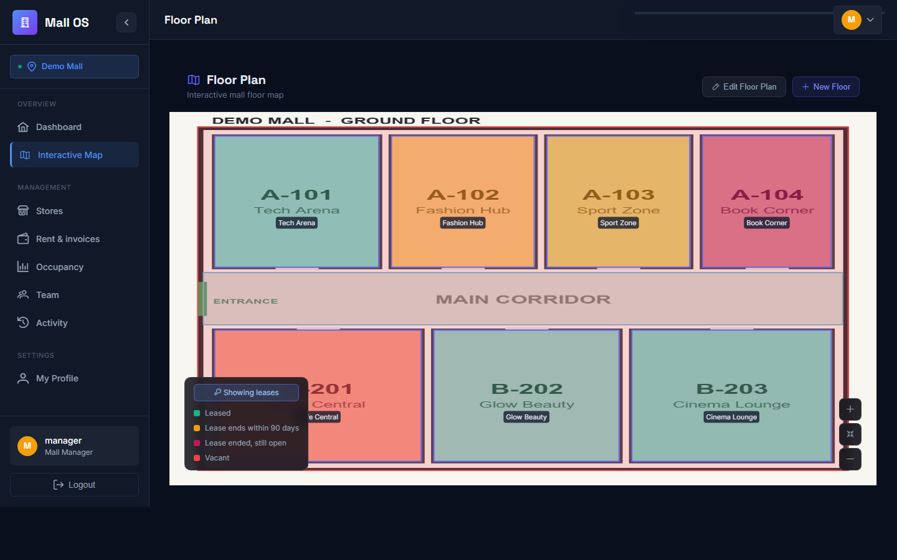
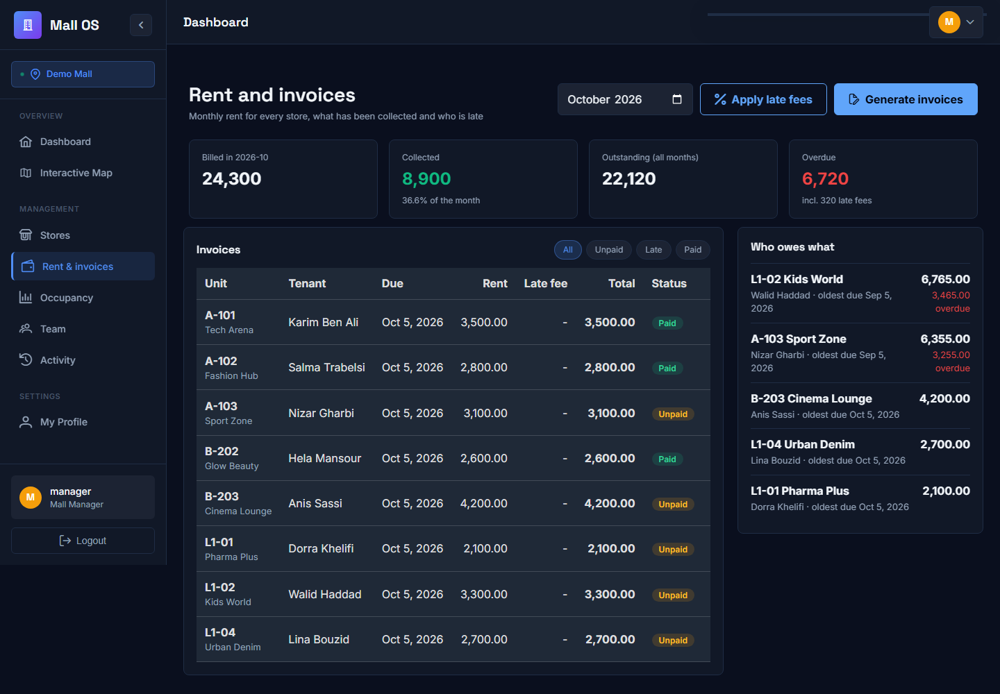
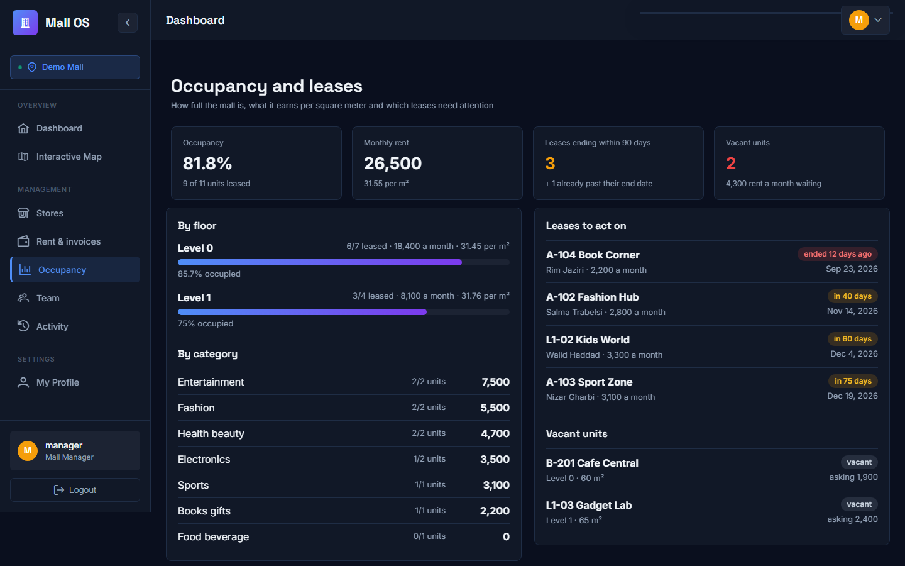
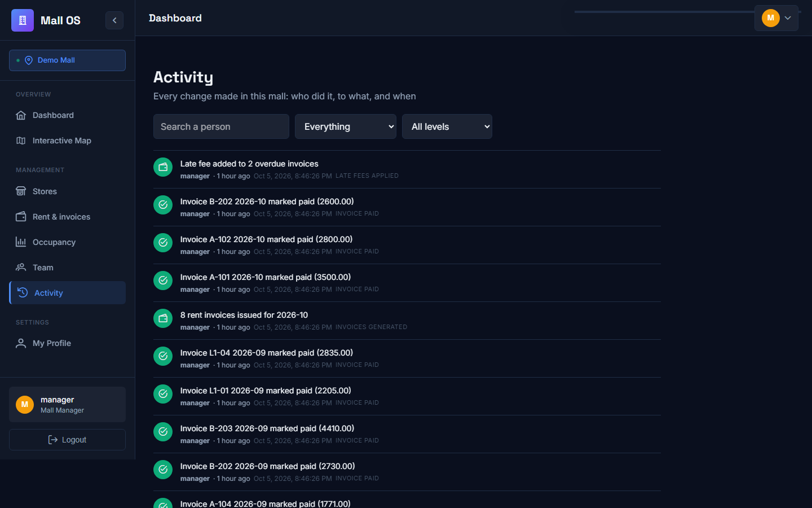
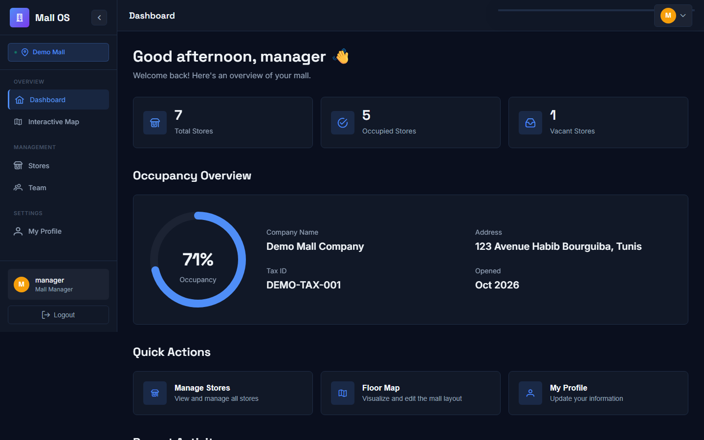
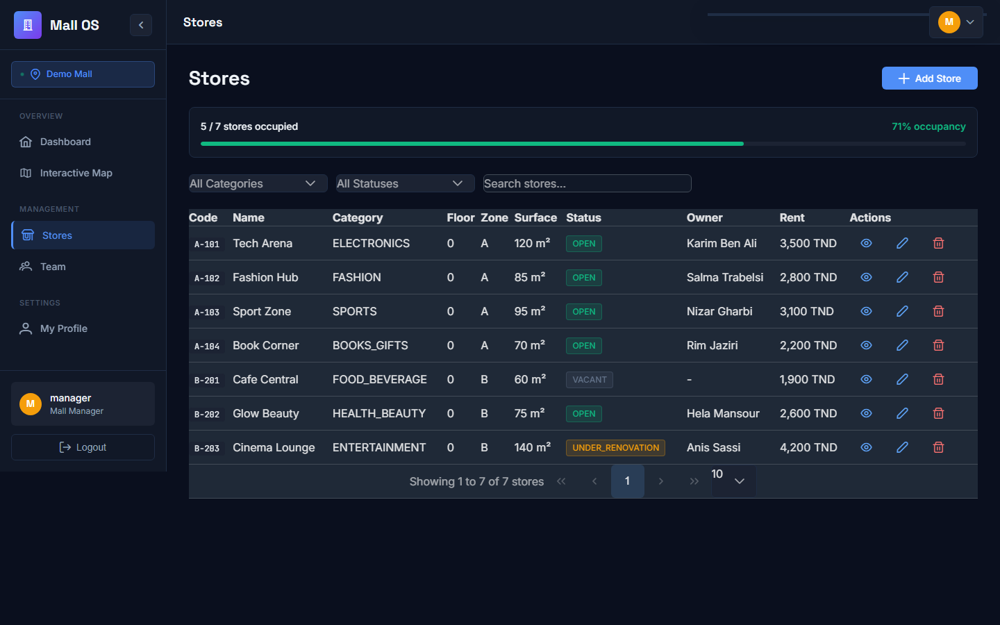
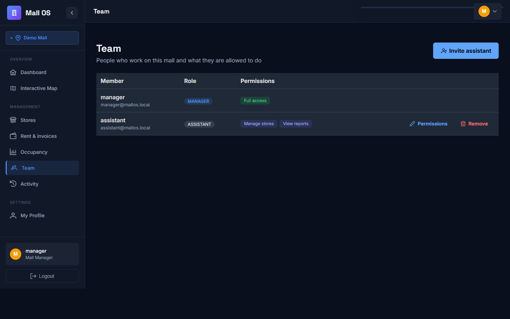
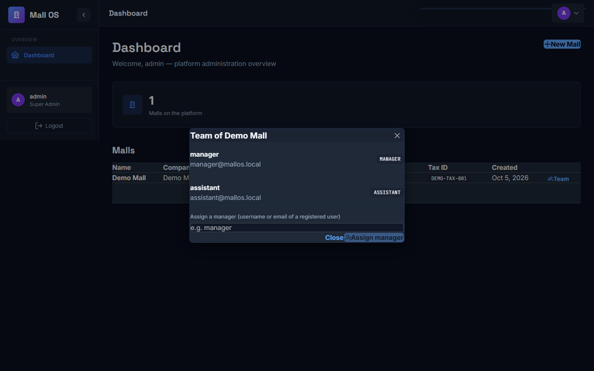
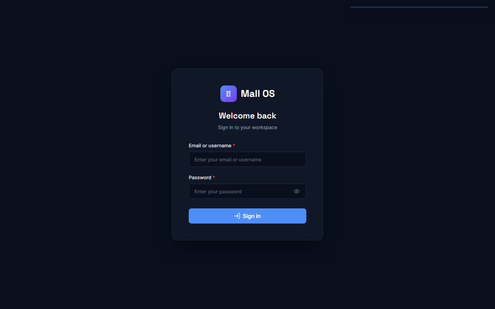

# Mall OS

A multi-tenant platform for running shopping malls. A platform administrator creates malls and assigns each one a manager; the manager uploads the **floor plan**, traces the shop units on it, links every unit to a store (tenant, rent, contract, status) and invites assistants with fine-grained permissions. Every mall is isolated from every other.

**Spring Boot 3 · Java 21 · MySQL · JWT · Angular 18 · PrimeNG · Docker**

**Live demo:** https://mall-os-self.vercel.app (sign in as `manager` or `assistant`, password `Manager@123`; the free API sleeps when idle, so the first request after a pause takes about a minute). Demo data only.

| Floor plan coloured by lease (green leased, orange ending within 90 days, crimson ended, red vacant) | Rent invoices and who owes what |
| --- | --- |
|  |  |

| Occupancy, rent per m² and lease expiry | Activity: who did what |
| --- | --- |
|  |  |

| Manager dashboard | Stores and occupancy |
| --- | --- |
|  |  |

| Team and permissions |
| --- |
|  |

| Admin: malls and their managers | Sign in |
| --- | --- |
|  |  |

## What it does

- **Floor plans**: upload an image of a floor (PNG, JPEG, WebP, GIF; the real file content is checked, not just the extension), trace polygons for units, corridors and common areas, and link each unit polygon to a store.
- **Stores**: code, category, zone, surface, status (open, closed, under renovation, vacant), owner, contract dates and monthly rent, with occupancy statistics.
- **Rent and invoices**: every billable store (not vacant, with a rent and a lease start) gets one invoice per month, generated automatically every morning and on demand for any month. A lease that starts or ends inside the month is charged for its days only (a lease from 11 March pays 21/31 of the rent). An invoice is due on the 5th; unpaid after that it carries a one-off 5 percent late fee. The finance screen shows billed, collected, outstanding and overdue money, the invoices with Paid and Cancel actions, and a "who owes what" list sorted by the worst debtor. Generating twice never bills twice, an invoice keeps the tenant name it was issued with, and a store that has invoices cannot be deleted.
- **Occupancy and lease analytics**: occupancy by floor and by category, monthly rent, rent per square meter (only counting units that have both a rent and a surface), rent waiting on vacant units, and the leases that end within 90 days or have already ended without the tenant leaving. The floor plan can be coloured by lease state with one click, so vacant and expiring units are visible on the map.
- **Audit trail**: every change (store created or edited with a before and after of rent, status or lease dates, floor plans, stores placed on the plan, team and permission changes, invoices issued, paid or canceled) is recorded with who did it and when, inside the same transaction as the change itself, so a failed operation leaves no entry and a successful one always does. Managers can search it by person, level and kind; the dashboard shows the latest lines. It replaces the hard-coded "recent activity" the dashboard used to show.
- **Roles and permissions**: a *super admin* runs the platform; a *manager* has full access to one mall; *assistants* get only the permissions the manager grants (manage stores, edit the floor plan, view reports, finance, ...).
- **Isolation**: a user can only reach the malls they belong to, and ids from another mall are never honored, even when put in the right URL.

## Run it

Needs Docker with Compose.

```bash
cp .env.example .env     # then set DB_PASSWORD and ADMIN_PASSWORD
docker compose up --build
```

| Service | URL |
| --- | --- |
| Web app | http://localhost |
| API | http://localhost:8080 (Swagger UI at `/swagger-ui.html`) |

On an empty database the first start creates a demo mall with a traced floor plan, 11 stores on two floors (with leases that are fine, about to end, and already over), three months of rent invoices (some paid, some late), a manager and an assistant.

| Role | Username | Password |
| --- | --- | --- |
| Super admin | `admin` | the `ADMIN_PASSWORD` you set in `.env` |
| Manager of the demo mall | `manager` | `Manager@123` |
| Assistant (stores and reports only) | `assistant` | `Manager@123` |

Try this: sign in as `manager`, open **Interactive Map** and press *Show leases*, then **Rent & invoices**. Then sign in as `assistant`: adding a store works, but the finance and activity pages, the floor plan editor and the Team page are refused (the assistant may see occupancy, which needs the reports permission).

## Security

The authorization model was already solid, so the audit (by running the app and attacking it with outsiders, assistants and managers of other malls) focused on what was around it. Findings, all fixed:

- `docker compose up` could not even start: an invalid default in the compose file (`${JWT_SECRET:default}`).
- Every mall call from the web app returned a 500: the UI used `/api/malls` while the API served `/malls`.
- Client mistakes (a non-numeric id, JSON sent to a file-upload endpoint, an unknown path) answered **500**; they are now 400, 415 and 404.
- The published development JWT key now makes the API refuse to start under the `prod` profile.
- Features that were half-built: the backend could manage assistants and managers but the web app had no screen for it. There is now a **Team** page for managers and a **Team** dialog for admins. Decorative controls that did nothing (a fake notification badge, a search button, hard-coded "+2 this month" trends) were removed instead of left in place.
- The demo floor plan polygons were stored in pixels while the viewer expects fractions of the image, so they were drawn far off the map and nothing on it could be hovered or clicked. The seed is fixed and the API now rejects polygon points outside 0 to 1.
- A global CSS reset sat above PrimeNG's styles and removed the padding of every PrimeNG button and table (buttons looked like bare links). The reset now lives in a lower cascade layer.
- The demo floor plan lives in the jar and is restored on start, so a host with an ephemeral disk does not lose it.

What was already good, and is covered by the tests: deny-by-default, roles re-read from the database on every request (so deactivating someone takes effect immediately), self-registration can only ever create a plain user, cross-mall access answers 403 and cross-mall ids in the wrong URL answer 404, uploaded images are only served to authenticated members, and no response ever contains a password hash.

## Tests

```bash
cd backend && mvn test
```

38 tests on an in-memory database (no services needed): the whole authorization matrix (outsiders, assistants with and without each permission, managers of other malls, ids smuggled into the wrong mall), upload validation, polygon coordinates, the team screen, tidy error answers and the JWT key guard, plus the new features: billing (proration, one invoice per store and month, late fee added once, paid invoices are final, the debtors list), who may see or change finance, the audit trail (what is recorded, filters, nothing recorded for a failed change, managers only, one mall's history never shows another's) and the occupancy figures. Each protection was checked by removing it and watching tests fail. CI also builds the web app and validates the compose file.

## Configuration

| Variable | Purpose |
| --- | --- |
| `DB_URL`, `DB_USERNAME`, `DB_PASSWORD` | database (compose fills these in) |
| `JWT_SECRET` | token signing key, at least 32 characters; the dev default is refused under the `prod` profile |
| `ADMIN_USERNAME`, `ADMIN_EMAIL`, `ADMIN_PASSWORD` | the super admin created on an empty database |
| `DEMO_ENABLED`, `DEMO_MANAGER_*` | seed the demo mall (on by default) |
| `SPRING_PROFILES_ACTIVE` | `prod` enables the key guard |
| `mallos.finance.due-day`, `mallos.finance.late-fee-percent`, `mallos.finance.cron` | day of the month rent is due (default 5), late fee in percent (default 5), when the daily billing job runs (default 05:30) |

## Deploying (free tiers, works with a private repository)

| Part | Where | How |
| --- | --- | --- |
| Database | TiDB Cloud Serverless | create a database named `mallos` |
| API | Render (Docker) | New, Blueprint, pick this repo: `render.yaml` does the rest; set `DB_URL`, `DB_USERNAME`, `DB_PASSWORD`, `ADMIN_PASSWORD` |
| Web app | Vercel | import the repo, Root Directory `frontend`; `frontend/vercel.json` forwards `/api` and `/auth` to the API, so the browser only ever talks to one origin |

The free API sleeps when idle: the first request after a pause can take about a minute.

## Project layout

```
backend/    Spring Boot API: mall (floors, polygons, stores, members, permissions), finance (invoices), analytics, audit, auth (JWT), config
frontend/   Angular 18 app: admin console and manager workspace (floor map viewer, trace editor, stores, team)
docs/       screenshots
```
